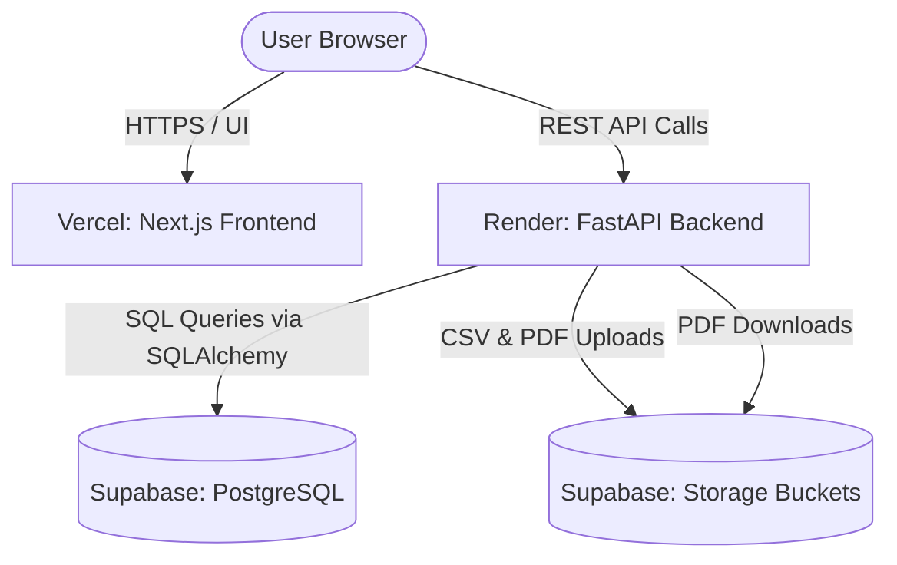
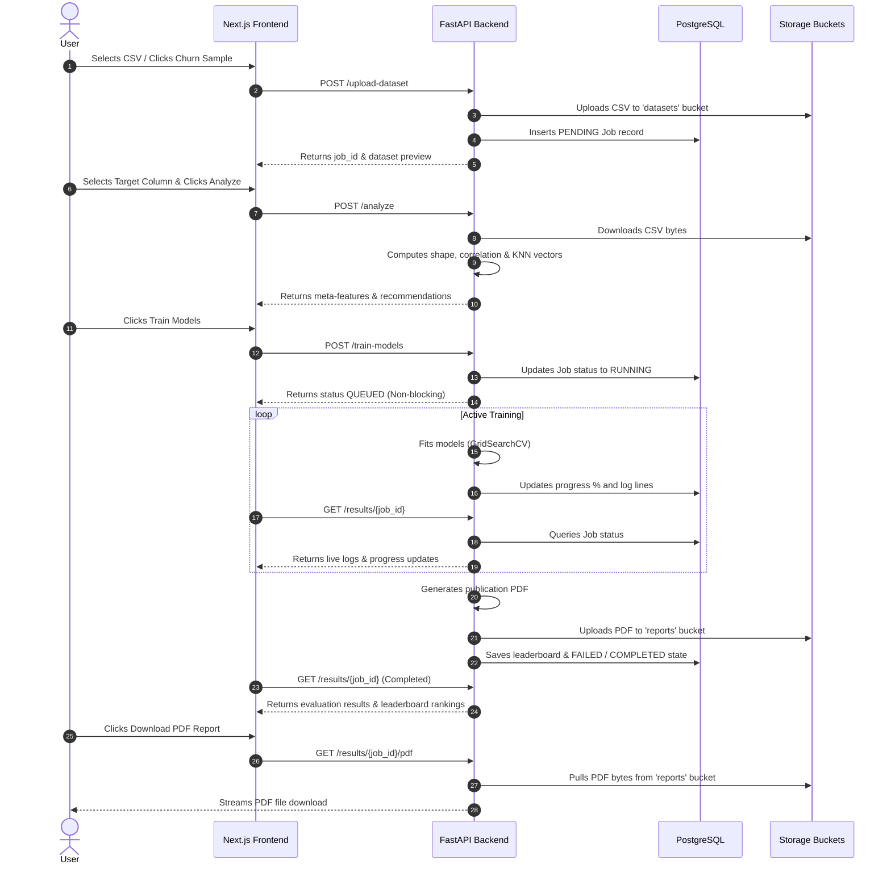

# OptiML | Intelligent AutoML & Meta-Learning Platform

OptiML is an enterprise-grade, full-stack AutoML and Meta-Learning platform designed to automate the machine learning lifecycle. It enables users to upload CSV datasets, automatically profiles dataset meta-features, queries a meta-learning engine for model recommendations, runs grid searches in parallel, visualizes training progression in a live Battle Arena, compiles leaderboards with feature importances, and exports publication-grade PDF reports.

---

## 1. System Features & Capabilities

### 📄 Dataset Upload & Preview
- **CSV Processing**: Accepts custom CSV uploads or generates a synthetic customer churn dataset for instant trial.
- **Smart Column Profiling**: Parses dataset structure, extracts column headers, identifies data types, and recommends default target labels.
- **High-Fidelity Preview Table**: Renders the first 10 rows of the dataset in a clean, interactive, paginated table with light/dark adaptive typography.

### 🧠 Rule-Based & KNN Meta-Learning
- **Meta-Feature Extraction**: Computes dataset shape (rows/columns ratio), missing value ratios, skewness mean, feature correlation matrices, and categorical feature densities.
- **KNN Meta-Learner**: Compares the dataset's meta-feature vector against historical dataset runs saved in the Postgres database using a K-Nearest Neighbors distance metric to identify similar data distributions.
- **AutoML Recommendation Advisor**: Recommends the optimal preprocessing scaling strategies (StandardScaler, MinMaxScaler, RobustScaler), class imbalance handling, and model priorities (e.g., advising tree-based ensembles for high-dimensional skewness).
- **Personality Classifier**: Dynamically tags the dataset with a distinct classification (e.g., *"Wide Sparse Dataset"*, *"Correlated Dense Grid"*) and assigns a corresponding personality character profile.

### ⚔️ AutoML Model Battle Arena
- **Asynchronous Training Worker**: Triggers non-blocking training jobs using FastAPI `BackgroundTasks` to avoid HTTP timeouts during long-running grid searches.
- **Multi-Algorithm Grid Search**: Evaluates 5 machine learning models in parallel:
  - **Logistic Regression**: Linear boundary baseline.
  - **Random Forest**: Ensemble bagging classifier.
  - **XGBoost**: Extreme gradient boosting classifier.
  - **Support Vector Machine (SVM)**: Optimal margin classifier.
  - **K-Nearest Neighbors (KNN)**: Spatial density classifier.
- **GridSearchCV Hyperparameter Tuning**: Automatically optimizes hyperparameters and reports accuracy, precision, recall, and F1 scores.
- **Live Consolidation Console**: Streams real-time fitting logs, accuracy increments, and training pipeline steps directly to a terminal console component on the frontend.

### 🏆 Leaderboard & Attribution
- **Sunset Leaderboard**: Ranks model evaluations, dynamically awarding the top-ranked model with a gold outline and a `BEST CHOICE` badge.
- **Feature Attribution Charting**: Compares and renders feature importances using dynamic gradient charts powered by Recharts.
- **AI Convergence Explanations**: Generates a detailed natural language summary explaining hyperparameter convergence and model choices.

### 📑 Publication-Grade PDF Reports
- **Dynamic ReportLab PDF Engine**: Generates a styled multi-page PDF document on completion of a training run.
- **Report Elements**: Includes cover page, metadata tables, model leaderboard, feature importances, and analytical summaries.

---

## 2. Cloud Architecture

OptiML is built on a modern, decoupled cloud stack designed for high availability and low resource footprints:

### 💻 Frontend (Vercel)
- **Next.js & React**: Implements a client-side layout with a left sidebar navigation aside panel.
- **Editorial Horizon Design System**: Uses a warm color palette (cream/charcoal canvas, brand orange highlights, custom light/dark modes) using vanilla CSS variables.
- **Dynamic Charts**: Uses Recharts to visualize model metrics and feature rankings.
- **Hydration & Polling Safety**: Employs client-only mounts and catches transient network drops as warnings, protecting the UX from developer overlay crashes during backend updates.

### ⚙️ Backend (Render)
- **FastAPI**: Serves the REST API using Python 3.12+.
- **SQLAlchemy ORM**: Connects to the database with SQLite fallback.
- **Supabase Storage Connector**: Uploads files to buckets, bypassing local disk storage.
- **CORS Trailing-Slash Sanitizer**: Automatically cleans URL lists to prevent browser blocks.

### 🗄️ Database & Storage (Supabase)
- **Supabase PostgreSQL**: Persists AutoML records (`jobs` and `meta_memory` tables).
- **Supabase Private Buckets**:
  - `datasets`: Houses uploaded `{job_id}.csv` files.
  - `reports`: Houses generated `report_{job_id}.pdf` files.

---

## 3. API Route Reference

| Endpoint | Method | Payload | Description |
| :--- | :--- | :--- | :--- |
| `GET /` | GET | None | Welcome greeting and database/storage connection diagnostics. |
| `GET /health` | GET | None | Liveness check (returns `{"status": "ok"}`). |
| `POST /upload-dataset` | POST | CSV (multipart) | Generates a `job_id`, uploads CSV to Supabase, parses column schemas, and returns a 10-row preview. |
| `POST /analyze` | POST | JSON `{"job_id", "target_column"}` | Synchronously calculates dataset meta-features, executes rule-based recommendations, and extracts KNN distributions. |
| `POST /train-models` | POST | JSON `{"job_id", "target_column"}` | Enqueues background AutoML grid search pipeline and updates job state to `RUNNING`. |
| `GET /results/{job_id}` | GET | None | Retrieves live training progress metrics, current log messages, or final evaluation outputs. |
| `GET /results/{job_id}/pdf` | GET | None | Downloads the publication report bytes from Supabase Storage and streams it to the user. |
| `GET /system-stats` | GET | None | Calculates overall system metrics (total datasets, models trained, average accuracy) and active experiment lists. |

---

## 4. Operational Flow

